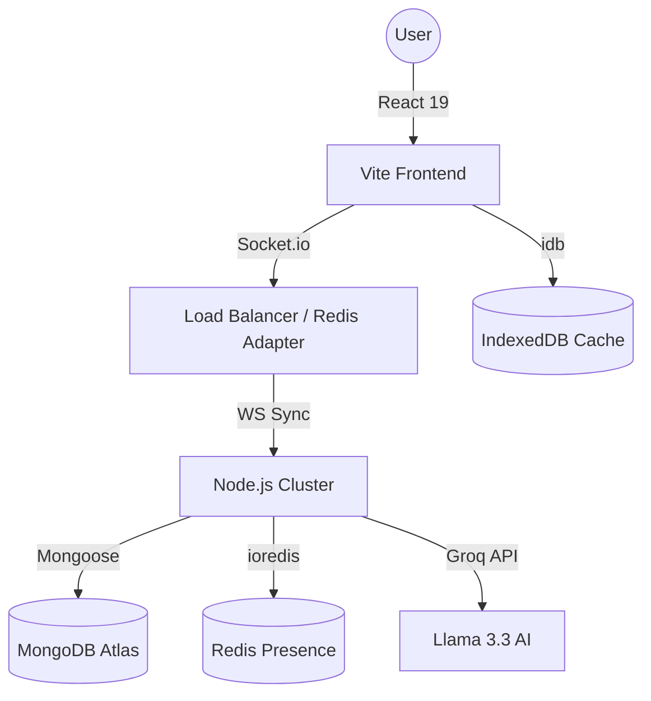

# 🌐 VertexFlow: The Enterprise-Grade AI Workspace

[](https://vertexflow.vercel.app)
[](https://github.com/Sadyal/VertexFlow)
[](LICENSE)

**VertexFlow** is a high-performance, professional-grade workspace platform that synthesizes the collaborative power of Google Docs with the networking depth of LinkedIn. Built on a modular MERN architecture and powered by Meta's Lexical engine, it delivers a seamless, real-time experience for modern professionals and teams.

---

## 🏛️ System Architecture

VertexFlow is engineered for horizontal scalability and low-latency interaction.



---

## 🚀 Key Feature Pillars

### 📝 1. Advanced Collaborative Editor (Lexical)
*   **Meta's Lexical Engine**: A state-of-the-art rich-text framework replacing legacy Tiptap for better performance and extensibility.
*   **Real-time CRDT-like Sync**: Multi-user collaboration with zero-conflict synchronization powered by custom Socket.io plugins.
*   **Media Intelligence**: Custom Image nodes with drag-and-drop support and automatic serialization.
*   **Export Engine**: Production-grade PDF and DOCX exports with high-fidelity CSS preservation.

### 🤖 2. Vertex AI Copilot
*   **Intelligence Layer**: Integrated with **Groq Llama 3.3 (70B)** for near-instant text processing.
*   **Semantic Tools**: Instant summarization, professional tone rewriting, and creative brainstorming directly within the editor.
*   **Contextual Awareness**: AI can analyze document state to provide relevant suggestions.

### 📡 3. Networking & Social Hub
*   **Presence 2.0**: Global real-time status tracking (Online/Away/Offline) backed by Redis.
*   **Dynamic Social Feed**: High-performance feed with infinite scroll and optimistic UI updates for likes and comments.
*   **Instant Messaging**: WhatsApp-style messaging with delivery status and typing indicators.

---

## 🔐 Authentication & Security Flow

VertexFlow employs a multi-layered security strategy to protect user data and maintain system integrity.

### **The Authentication Pipeline:**
1.  **Registration**: User signs up; system generates a secure 6-digit OTP.
2.  **Verification**: **Nodemailer** dispatches the OTP. User verifies identity before account activation.
3.  **Authentication**: Post-login, a **JWT (JSON Web Token)** is generated using `HS256`.
4.  **Session Persistence**: The token is stored in an **HttpOnly, Secure Cookie** to mitigate XSS attacks.
5.  **RBAC Enforcement**: 
    *   **User Role**: Standard access to documents and networking.
    *   **Admin Role**: Access to `/admin` dashboard, system analytics, and maintenance controls.

---

## 🛠️ Technical Stack (Production Edition)

### **Frontend**
*   **Framework**: React 19.2 (Stable)
*   **Build Tool**: Vite 8.0 (Fast HMR)
*   **Editor Engine**: Lexical 0.44
*   **Real-time**: Socket.io-client 4.8
*   **State & Caching**: IndexedDB (via `idb`), React Context
*   **Styling**: Pure CSS3 with Hardware-Accelerated Glassmorphism

### **Backend**
*   **Runtime**: Node.js 20.x
*   **Framework**: Express 5.2 (Latest)
*   **Database**: MongoDB 9.5 (Mongoose)
*   **Scaling**: Redis Stack (ioredis + Redis Adapter)
*   **AI**: Groq SDK (Llama 3.3 70B)
*   **Processing**: Sharp (Images), Multer (Uploads)

---

## ⚡ Performance Engineering

*   **LCP Preloading**: Social feed images are programmatically preloaded to ensure an LCP under 1.2s.
*   **Instant-On Rendering**: Documents are hydrated from **IndexedDB** before the socket connection is even established.
*   **Lazy Loading**: Heavy modules (PrismJS, html2pdf) are code-split and loaded on demand.
*   **Graceful Shutdown**: Server handles `SIGTERM` to close database and Redis connections cleanly, preventing data corruption.

---

## 🛠️ Installation & Setup

### **Prerequisites**
*   Node.js v18+
*   MongoDB Instance
*   Redis Server (Optional for Dev, Required for Production)
*   Groq API Key

### **Quick Start**
```bash
# 1. Clone
git clone https://github.com/Sadyal/VertexFlow.git
cd VertexFlow

# 2. Server Setup
cd server && npm install
cp .env.example .env # Add your keys here

# 3. Frontend Setup
cd ../frontend && npm install
npm run dev
```

---

## 🛡️ License & Acknowledgments
Distributed under the **MIT License**.  
Developed with passion by **[Sadyal](https://github.com/Sadyal)**. 🚀
