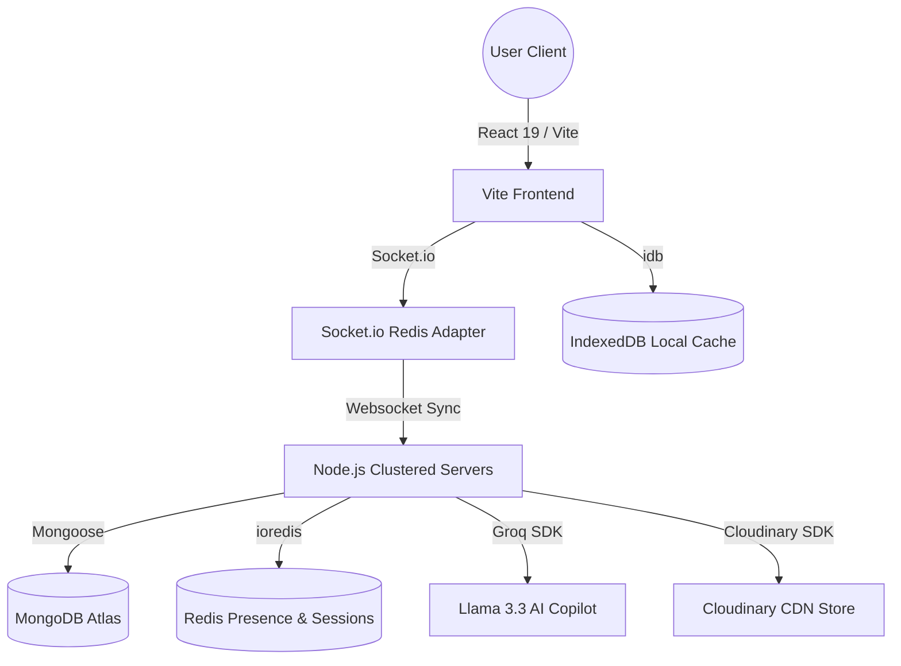

# 🌐 VertexFlow: The Enterprise-Grade Collaborative AI Workspace

[](https://vertexflow.vercel.app)
[](https://github.com/Sadyal/VertexFlow)
[](LICENSE)

**VertexFlow** is a premium, high-performance workspace platform that combines the collaborative utility of real-time editing (similar to Google Docs) with the professional networking depth of social channels (similar to LinkedIn). 

Engineered with a robust, modular **MERN** architecture, it uses **Meta's Lexical** engine for rich text manipulation, **Socket.io** for real-time document synchronization and presence, **Redis** for clustered multi-tab state tracking, and **Groq (Llama 3.3 70B)** for a contextual AI copilot.

---

## 🏛️ System Architecture

VertexFlow is built for horizontal scalability, low latency, and cluster-safe operations.



> [!NOTE]
> All document edits are loaded instantly from **IndexedDB** on the frontend for zero-friction (0ms) layout hydration before websocket connections sync the newest server updates.

---

## 🚀 Key Feature Pillars

### 📝 1. Advanced Collaborative Editor
* **Meta's Lexical Engine**: Powered by Lexical `0.44`, providing high-performance rich-text processing, clean DOM parsing, and modular extensibility.
* **Real-time Sync**: Operational synchronization powered by custom Socket.io rooms, ensuring zero-conflict document updates between multiple editors.
* **Media Optimization**: Integrated drag-and-drop image node processing. Images are compressed to WebP via **Sharp** and uploaded directly to **Cloudinary** for CDN delivery.
* **Document Export**: High-fidelity PDF and Word Document (`DOCX`) export utilities with complete stylesheet preservation.

### 🤖 2. Vertex AI Copilot
* **Groq Llama 3.3 (70B) Integration**: Contextual AI completion with sub-second token latency via the Groq SDK, falling back to Llama 3 (8B) if limits are reached.
* **Semantic Editing Suite**: High-quality document tools for summarizing, tone rewriting (e.g. converting rough notes to professional copy), and structured brainstorming directly inside the text selection.
* **Workspace Chat Context**: Users can query the copilot with direct reference to the active document's contents.

### 📡 3. Networking & Social Hub
* **Multi-Tab Presence 2.0**: Accurate online status tracking (Online / Offline / Idle) backed by Redis sets, capable of scaling across multiple backend nodes.
* **Real-Time Instant Messaging**: Private user chat using Socket.io with delivery status, live typing indicators, and emoji reactions.
* **Dynamic Social Feed**: Infinite-scroll feed using optimistic UI updates for instant like, comment, and sharing interaction.

### 🛡️ 4. Administration Dashboard
* **Full-Stack Moderation**: Admin route (`/admin`) for inspecting user status, managing active documents, and deleting malicious posts.
* **System Operations**: Maintenance mode controls that pause backend operations, global analytics dashboards, and application setting configurations.

---

## 📡 WebSocket Event Protocol

Real-time interactions are segmented into dedicated handlers to protect system execution resources.

### 1. Document Collaboration (`doc.socket.js`)

| Event Name | Direction | Payload Structure | Description |
| :--- | :--- | :--- | :--- |
| `get-document` | Client ➔ Server | `docId: String`, `userMetadata: Object` | Requests entry to a document room, initializes members, and loads document states. |
| `load-document` | Server ➔ Client | `{ content: Object/String, updatedAt: Date }` | Fires upon joining; populates the Lexical editor. |
| `send-changes` | Client ➔ Server | `delta: Object` | Transmits rich-text changes. Protected by rate limiting and a 2MB maximum limit. |
| `receive-changes`| Server ➔ Client | `delta: Object` | Broadcasts text deltas to all other active editors in the room. |
| `presence-update`| Client ➔ Server | `{ status, isTyping, cursor, activeBlock }` | Updates editor awareness metadata (e.g. cursor coordinates, active line block). |
| `presence-updated`| Server ➔ Client| `{ socketId, userId, status, isTyping, cursor, activeBlock }` | Broadcasts awareness adjustments to the rest of the editors. |
| `save-document` | Client ➔ Server | `content: Object/String` | Persists changes to MongoDB. Emits `save-confirmed` upon completion. |
| `update-title` | Client ➔ Server | `newTitle: String` | Renames document. Cleans zero-width characters and limits updates to 1 per second. |
| `access-denied` | Server ➔ Client | *None* | Emitted if a user lacks collaborative access to a requested document. |

### 2. Networking & Chat (`network.socket.js`)

| Event Name | Direction | Payload Structure | Description |
| :--- | :--- | :--- | :--- |
| `private-message` | Client ➔ Server | `{ recipientId: String, content: String }` | Dispatches message to a target user. Saves to database and sends to all user tabs. |
| `receive-message` | Server ➔ Client | `message: Object` | Broadcasts new message back to sender and recipient devices. |
| `message-reaction`| Client ➔ Server | `{ messageId, recipientId, emoji }` | Applies an emoji reaction to a chat message. |
| `send-friend-request`| Client ➔ Server| `{ recipientId, requesterName }` | Triggers a real-time friend invite banner. |

> [!IMPORTANT]
> **Cluster & Multi-Tab Rules:**
> * **Tab Limit Enforcement:** Standard users are limited to a maximum of **3 active tabs**. Exceeding this evicts the oldest active socket with a `tab-limit-exceeded` event.
> * **Orphan Cleanup:** An active background worker runs on Redis scan loops every 60 seconds to prune orphan sockets and update online user metrics.
> * **Sliding Expiration:** Sockets emit a `heartbeat` event every 20 seconds, updating the active user session TTL in Redis to 90 seconds.

---

## 🛠️ Technical Stack

### Frontend Core
* **Library / Build:** React 19.2 (Stable) + Vite 8.0 (Fast HMR)
* **Editor Core:** Lexical Editor (0.44) + PrismJS (syntax highlighting)
* **WebSockets:** Socket.io-client 4.8
* **Caching:** IndexedDB (via the `idb` library)
* **Styles:** Vanilla CSS3 + custom Glassmorphism variables (No TailwindCSS)

### Backend Services
* **Runtime:** Node.js 20.x + Express 5.2 (Router-level payload sanitization)
* **Database:** MongoDB 9.5 (Mongoose ODM)
* **Session Cache:** Redis Stack (ioredis client + `@socket.io/redis-adapter`)
* **AI Engine:** Groq SDK (Llama 3.3 70B Versatile model)
* **Media Handling:** Sharp (Image decompression/conversion) + Multer (Multipart parser)
* **Mail:** Nodemailer (SMTP relay wrapper)

---

## 📂 Project Structure

```
VertexFlow/
├── frontend/
│   ├── public/              # Static assets
│   ├── src/
│   │   ├── app/             # Main App component & routing definitions
│   │   ├── assets/          # Base styling images/SVG icons
│   │   ├── components/      # Shared components (common UI, layouts, protection wrappers)
│   │   ├── context/         # Application level state providers (Auth, Socket)
│   │   ├── hooks/           # Custom React hooks
│   │   ├── modules/         # Modular feature folders (Admin, Auth, Document, Network, Social, User)
│   │   ├── pages/           # Base landing files (Home)
│   │   └── utils/           # Helper libraries
│   ├── package.json
│   └── vite.config.js
│
├── server/
│   ├── config/              # DB, Redis, and SMTP initializers
│   ├── middleware/          # Security headers, rate limiters, error, and maintenance controls
│   ├── models/              # Mongoose DB schema designs (User, Doc, Post, Comment, Message)
│   ├── modules/             # Server API controllers, routes, and services
│   ├── sockets/             # Real-time WebSocket event registries and cluster state managers
│   ├── uploads/             # Temp directory for processing user image uploads
│   ├── utils/               # Activity loggers, password hashes, and Cloudinary streams
│   ├── package.json
│   └── server.js            # Main cluster bootstrapper
```

---

## 🔐 Security & Data Protection Pipeline

VertexFlow uses strict protection systems at the entry layer:

1. **Double OTP Authentication**: Accounts require verification via a 6-digit one-time password generated at signup and dispatched via Nodemailer.
2. **HttpOnly Cookies**: Session tokens are encrypted (`HS256` JWT) and written to secure HTTP-only cookies, neutralizing XSS exploits.
3. **Array/Nesting Sanitizer**: Body parser interceptor rejects deeply nested objects or large array payloads, preventing server memory starvation.
4. **Strict Request Limits**: Heavy endpoints (e.g. Login, Doc-saving) are bound to Express-Rate-Limit constraints. A 10-second request timeout guard is applied to all incoming API requests.

---

## ⚙️ Environment Configuration

Set up `.env` files in their respective folders before running the system.

### Server Env (`server/.env`)
Create `server/.env` based on `server/.env.example`:
```ini
PORT=4000
NODE_ENV=development

# Database Connection
MONGO_URI=mongodb+srv://...

# Authentication Secrets
JWT_SECRET=your_jwt_signature_secret
CRON_SECRET=your_cron_pinger_secret

# Email Config
SMTP_HOST=smtp-relay.brevo.com
SMTP_PORT=587
SMTP_USER=your_smtp_sender_user
SMTP_PASS=your_smtp_password
SENDER_EMAIL=no-reply@vertexflow.com

# Redis Configuration
REDIS_URL=rediss://default:...

# AI & Media Services
GROQ_API_KEY=gsk_...
CLOUDINARY_CLOUD_NAME=your_cloudinary_cloud_name
CLOUDINARY_API_KEY=your_cloudinary_api_key
CLOUDINARY_API_SECRET=your_cloudinary_api_secret
```

### Frontend Env (`frontend/.env`)
Create `frontend/.env`:
```ini
VITE_API_URL=http://localhost:4000
```

---

## 🚀 Installation & Running Locally

### 1. Clone & Core Setup
```bash
git clone https://github.com/Sadyal/VertexFlow.git
cd VertexFlow
```

### 2. Backend Initialization
```bash
cd server
npm install
# Add configurations in .env
npm run dev
```

### 3. Frontend Initialization
```bash
cd ../frontend
npm install
# Add configurations in .env
npm run dev
```

### 🛠️ Developer Utility Scripts (Server folder)
* **Seed Database:** Populates MongoDB with default test accounts (`owner@test.com`, `collab@test.com`) and a shared document (`test-doc-id-12345`) for offline validation:
  ```bash
  node seed_test_data.js
  ```
* **Elevate Admin Role:** Converts the first user in the DB into an administrator to grant access to the system dashboard:
  ```bash
  node makeAdmin.js
  ```
* **WebSocket Integration Verification:** Connects multiple mock sockets to validate cluster presence syncing and document edits locally:
  ```bash
  node test_socket.js
  ```

---

## 🛡️ License & Acknowledgements
This project is licensed under the **MIT License**. Created with passion for high-performance collaborative engineering. Developed by **[Sadyal](https://github.com/Sadyal)**. 🚀
